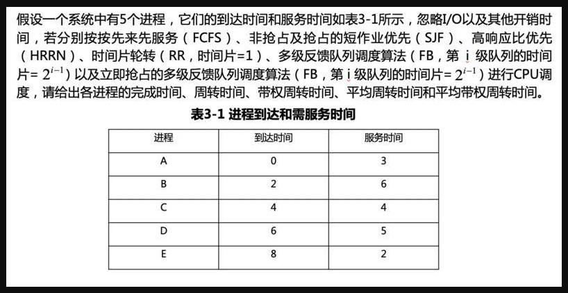

先来先服务：

| 进程 | 到达时间 | 服务时间 | 完成时间 | 周转时间 | 带权周转时间 | 平均周转时间 | 平均带权周转时间 |
| :--: | :------: | :------: | :------: | :------: | :----------: | :----------: | :--------------: |
|  A   |    0     |    3     |    3     |    3     |      1       |              |                  |
|  B   |    2     |    6     |          |          |              |              |                  |
|  C   |    4     |    4     |          |          |              |              |                  |
|  D   |    6     |    5     |          |          |              |              |                  |
|  E   |    8     |    2     |          |          |              |              |                  |

